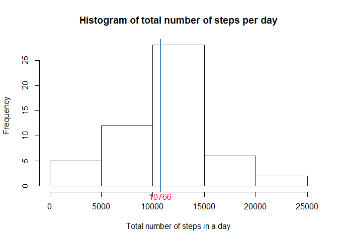
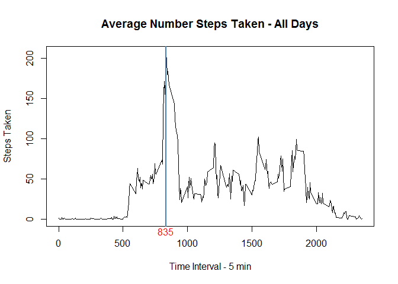
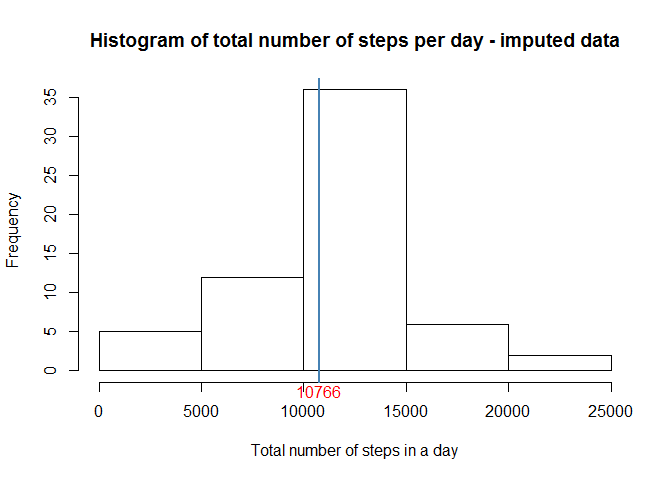
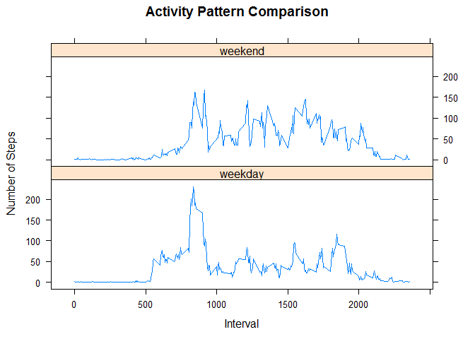

# Reproducible Research: Peer Assessment 1

## Libraries and Knitr settings
Start by loading the libraries that will be used and set the knitr options to echo all


```r
knitr::opts_chunk$set(echo = TRUE)
library(lubridate)
```

```
## 
## Attaching package: 'lubridate'
```

```
## The following object is masked from 'package:base':
## 
##     date
```

```r
library(dplyr)
```

```
## 
## Attaching package: 'dplyr'
```

```
## The following objects are masked from 'package:lubridate':
## 
##     intersect, setdiff, union
```

```
## The following objects are masked from 'package:stats':
## 
##     filter, lag
```

```
## The following objects are masked from 'package:base':
## 
##     intersect, setdiff, setequal, union
```

```r
library(ggplot2)
library(lattice)
```

## Loading and preprocessing the data
Load the data from the supplied activity file and store date as POSIX date


```r
## unzip the zip file to a temporary directory
filename <- "activity.zip"
td <- tempdir()
unzip(filename, ex = td)

## read the text file and transform the date field
filename <- file.path(td, "activity.csv")
activity <- read.csv(filename,na.strings = "NA", stringsAsFactors = FALSE)
activity$date <- ymd(activity$date)
```

## What is mean total number of steps taken per day?
Summarize the activities by date to get the total steps - filtering out all the NA values.
calculate the mean and median and then plot the histogram (not a barplot) of total steps - showing the mean


```r
## create activity summary with total steps by date
activity_summary <- activity %>%
    filter(!is.na(steps)) %>%
    group_by(date) %>%
    summarise(Total_steps=sum(steps))

## calculate the mean and median
mean_steps <- mean(activity_summary$Total_steps)
median_steps <- median(activity_summary$Total_steps)

mean_steps
```

```
## [1] 10766.19
```

```r
median_steps
```

```
## [1] 10765
```

```r
## plot a histogram of the total steps per day
hist(activity_summary$Total_steps, main="Histogram of total number of steps per day", 
     xlab = "Total number of steps in a day")
abline(v=mean_steps, col="steelblue", lwd=2, lty=1)
mtext(as.integer(mean_steps), side = 1, at = mean_steps, col="red")
```

<!-- -->

The value of mean total number of steps taken per day is: 10766


## What is the average daily activity pattern?
Take the mean of the average steps by interval time - excluding the missing values 
Calculate the interval that contains the highest number of steps and create a time-
series plot showing those details.


```r
## What is the average daily activity pattern
activity_interval <- activity %>%
    filter(!is.na(steps)) %>%
    group_by(interval) %>%
    summarise(Average_steps=mean(steps))

## identify highest 5 minute interval
highest_interval <- activity_interval$interval[which.max(activity_interval$Average_steps)]
highest_interval
```

```
## [1] 835
```

```r
with(activity_interval, 
    plot(interval, Average_steps, type='l', col='black', 
         ylab = "Steps Taken",
         xlab = "Time Interval - 5 min",
         main = "Average Number Steps Taken - All Days"))
abline(v=highest_interval, col="steelblue", lwd=2)
mtext(highest_interval, side = 1, at = highest_interval, col="red")
```

<!-- -->

The 5 minute interval with highest value is: 835

## Imputing missing values
Devise a method to impute the values of missing data, recalc the mean and show the 
histogram plot of the activity with imputed values.


```r
## Calculate and report the total number of missing values in the dataset (i.e. the total number of rows with NAs)
sum(is.na(activity))
```

```
## [1] 2304
```

```r
## impute the missing values by using the value calculated from average daily activity pattern

## Returns the total Steps for matched interval
fix_step <- function(x, y) {
    as.numeric(x[which(x$interval == y),2])
}

fix_sub1 <- subset(activity, is.na(steps))
fix_sub2 <- subset(activity, !is.na(steps))

## fix missing data by using corresponding daily activity interval 
for (x in 1:nrow(fix_sub1))
{
    fix_sub1[x, 1] <- fix_step(activity_interval, fix_sub1[x, 3])
}

activity_fix <- bind_rows(fix_sub1, fix_sub2) %>%
                arrange(date, interval)

activity_summary <- activity_fix %>%
    group_by(date) %>%
    summarise(Total_steps=sum(steps))

## calculate the mean and median
mean_steps <- mean(activity_summary$Total_steps)
median_steps <- median(activity_summary$Total_steps)

mean_steps
```

```
## [1] 10766.19
```

```r
median_steps
```

```
## [1] 10766.19
```

```r
## plot a histogram of the steps per day
hist(activity_summary$Total_steps, main="Histogram of total number of steps per day - imputed data", 
     xlab = "Total number of steps in a day")
abline(v=mean_steps, col="steelblue", lwd=2, lty=1)
mtext(as.integer(mean_steps), side = 1, at = mean_steps, col="red")
```

<!-- -->

Note that the shape of the data has not dramatically changed with the imputed data 
This is preferred and therefore confirms the stability of the method.

## Are there differences in activity patterns between weekdays and weekends?
Using the activity with imputed values filling in for the missing values 
compare the activity patterns for weekdays and weekends.  Do this by creating an 
is.weekend function, create a factor variable separating those activities on a weekday or 
weekend.  Then plot two panels comparing the average steps by intervale by that factor. 


```r
## set a factor to weekend or weekday depending on day of the week for a date
is.weekend <- function(x) ((as.numeric(x)-2) %% 7) < 2
activity_fix <- activity_fix %>%
    mutate(day_type = ifelse(is.weekend(date),"weekend","weekday"))
activity_fix$day_type = factor(activity_fix$day_type,levels=c("weekday", "weekend",ordered=TRUE))

activity_interval <- activity_fix %>%
    group_by(day_type, interval) %>%
    summarise(Average_steps=mean(steps))

## plot two panels with activity 
xyplot(Average_steps~interval | day_type, data=activity_interval, type = 'l', layout=c(1,2), 
       xlab = "Interval", ylab="Number of Steps", main = "Activity Pattern Comparison" )
```

<!-- -->

There are definitely differences between activites on weekdays and weekends.
There is more of a gradual slope to acheiving the peak to activity on a weekend.  
Additionally it appears that the activity is distributed more evenly throughout the day rather
than being packed into the 8am to 10am timeframe for a weekday.  
